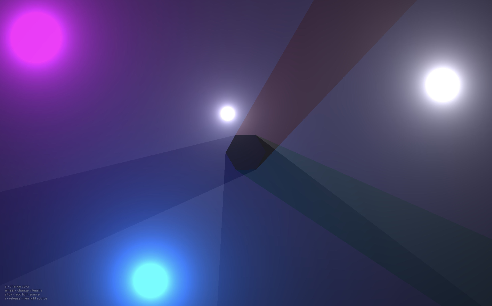

[](https://light..a-laud.ru)

# Light

A GPU-accelerated light simulation web application that renders dynamic light sources

## Features

- Real-time light rendering with GPU.js acceleration
- Multiple light sources with color and intensity control
- Interactive light placement and manipulation
- Obstacle rendering with opacity effects
- Progressive Web App (PWA) support

## Demo

Visit the live demo at: [https://light..a-laud.ru](https://light.a-laud.ru)

## Screenshot



## Controls

- **Click**: Add a new light source
- **C key**: Change the color of the main light source
- **Mouse wheel**: Change light intensity
- **R key**: Release control of the main light source
- **H key**: Hide/show all obstacles
- **Space**: Add/move random light sources

## Installation

1. Clone the repository:
```bash
git clone https://github.com/kshshe/light.git
cd light
```

2. Install dependencies:
```bash
npm install
```

3. Start the development server:
```bash
npm start
```

4. Open your browser and navigate to `http://localhost:1234`

## Building for Production

```bash
npm run build
```

The production-ready files will be available in the `dist` directory.

## Technologies Used

- [GPU.js](https://gpu.rocks/) - GPU accelerated JavaScript
- [Parcel](https://parceljs.org/) - Web application bundler
- Vanilla JavaScript, HTML5, and CSS3